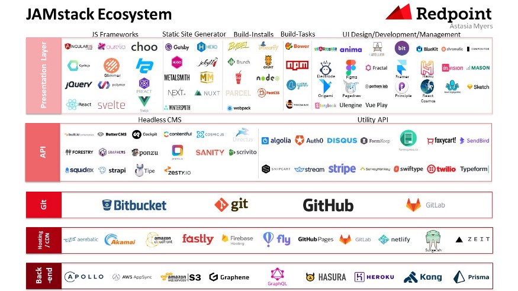

# Jamstack Notes

There are many approaches to delivering websites.

The earliest model was purely static. Later, dynamic content became possible through running scripts on the server.

But now the server needed to have enough capacity to service every request. This lead to the introduction of different pieces of infrastructure, with load balancers and database servers in addition to web servers. Assets that were static and didn't need to be generated on the fly could now be stored on CDNs. All of this made the process more complicated.

Over time, browsers got more capable, processes matured and tooling improved.

### What is the Jamstack?

Jamstack stands for JavaScript, APIs and Markup.

A stack is the layers of technology which deliver your site or application.

Jamstack means fast and secure sites and apps delivered by pre-rendering files and serving them directly from a CDN, removing the requirement to manage or run web servers.

For example, the Lamptack stands for Linux (operating system), Apache (HTTP routing and serving), MySQL (data access) and PHP (preprocessing). As load increases, you would typically have multiple servers all running this stack.

By contrast, with the Jamstack, a CDN/static server handles HTTP routing and serving, JavaScript and Markup effectively provide the runtime directly in the browser and APIs provide data access.

Jamstack is about having assets pre-rendered, leveraging the browser and operating without a web server.

With Jamstack, the stack has moved up a level to the browser.

Aaron Schwartz used the phrase "Bake, don't fry" to describe preparing a response ahead of time, rather than serving it up on demand.

Motives for pre-rendering:

- You do the work now so your servers don't have to later.
- It puts distance between the complexity and the user.

This can simplify deployments.

Traditionally, deployments require updates in lockstep to happen to each link: the CDN, load balancer, web server and database server.

With the Jamstack, deployment essentially means updating one resource (the CDN) in a known, prediuctable way.

You can leverage version control for everything.

Other advantages of Jamstack:

- security
- performance
- scale

Jamstack offers a greatly reduced surface area. There are far fewer moving parts to attack. The more infrastructure you have, the more you have to secure. There is no server more secure than the one that doesn't exist.

Traditional stacks often add **static layers** to improve performance, that means caching.

With Jamstack, every time you do a deplpoyment to your CDN you are effectively updating the entire serving cache.

Caching is hard. The more you can simplify the model of caching, the better.

Traditional stacks **add infrastructure** in order to scale. More servers mean more costs and more complexity.

By design, in the Jamstack everything is cached so you are in an optimal position, serving everything from a CDN designed to handle high load.

Jamstack benefits from enablers:

- static site generators
- tooling and automation
- browser capabilities
- services and the API economy

Static site generators combine templates and data to generate resources at build time rather than at request time.

With the API economy, companies now offer services that you would previously have had to build in-house.

### Rendering

Client-Side Rendering (CSR) - JavaScript is executed in the browser to manipulate the DOM at request time

Server-Side Rendering (SSR) - Markup can be generated on request in the server and transmitted to the client. Markup can also be generated at build time so that it's ready to transmit to the client when needed.

With both client-side rendering and server-side rendering at build time, per request you don't need to execute any logic on the server.

### Static Site Generators

A static site generator is a tool that takes in data, content and templates, processes them, and outputs a folder full of the resulting pages and assets.

Choosing a static site genrator can depend on: language, workflow, performance, architecture, output control and level of adoption.

For example, [Eleventy](https://www.11ty.dev/) has a logical architecture, flexible templating, does nothing you don't ask for and is JavaScript all the way down.

### Pulling in data with APIs

Data sources can include: headless content management systems, pricing engines, ecommerce engines, stock levels, tweets, newsfeeds and on and on.

You can pull that content in at build time using APIs.

By only calling data at build-time, the number of requests depends on the number of builds, not the number of visitors to your site/app. This can greatly reduce the load on your data source.

You can trigger a build to run every couple of minutes to keep the data fresh or when the data changes so that you only build when there is an update to show.

### Personalization

Just because a site is pre-generated, doesn't mean it can't be personalized.

Sites exist on a spectrum from fully universal to fully personalized content. This spectrum also contains localized and internationalized content and content targeted to groups (for example, admin roles).

Jamstack can actually address the entire spectrum; it's a question of how much you do in the browser with client-side JavaScript.

The services provided by the API economy are key for personalization and localization.

Since all of your assets are on the CDN, adding some relatively simple logic there can route different people to different assets.

It is getting easier to configure CDNs. With Netlify a redirects file lets you redirect by country or language.

Jamstack lets you:

- generate views for many locales
- route traffic at the CDN
- generate a CDN config based off your data

### Progressive Enhancement

1. decide on what's critical to the experience
2. deliver as much as possible using as little as possible
3. detect supported features and enhance where possible

One problem with making API calls from the client is that they are exposed. This has been one reason for making these calls from a serever.

Services like Netlify now mean you can proxy these API calls through a serverless function, keeping your API secrets safe.

Serverless functions blur the lines of Jamstack, being a close ally of Jamstack if not part of the Jamstack itself.

The growing ecosystem of tools and services lets you move beyond static.

### Introducing the Jamstack to existing infrastructure

Don't try to boil the ocean. Don't attempt a bulk move of everything to the Jamstack.

Take [CSS-Tricks](https://css-tricks.com/) for example. The main site runs on Wordpress but their [Conferences site](https://conferences.css-tricks.com/) is a Jamstack site on its own subdomain.

By adding redirects to your CDN, you can start adding layers of Jamstack sites in front of your existing infrastructure.
